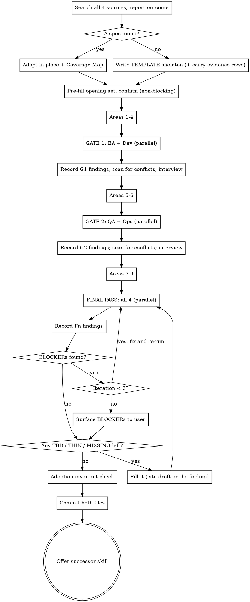

# Amigos

## Overview

Four independent subagents - **BA, Dev, QA, Ops** - attack a draft spec from four incentives, and their questions drive an interview that fills nine required coverage areas.

**Core principle:** a single model role-playing four perspectives converges into one perspective. Separate context windows are the cheapest available proxy for separate incentives.

**Announce at start:** "I'm using the amigos skill to produce the spec."

## Every Topic Gets the Full Process

All 9 areas, both gates, the final pass - for a config change, a one-field addition, a bug fix, everything. Areas may be *short*; they may not be *absent*.

"This is too simple for the full process" is how unexamined scope becomes rework. There is no lite mode and no decline path.

## Output

Two files, both under `docs/superpowers/specs/`:

| File | What it is |
|---|---|
| `<the spec>` | **Adopted if one already exists** (edited in place, at its own path). Created as `YYYY-MM-DD-<topic>-design.md` only if none does. |
| `<same basename, suffix -amigos.md>` | The amigo review record - what each amigo read, asked and found, gate by gate |

No third artifact. No worktree. No `charters/` directory. No renaming or moving of the adopted file.

## Adopt, Never Overwrite

**This skill hardens an existing spec. It does not replace one.**

`superpowers:brainstorming` writes to `docs/superpowers/specs/`. `superpowers:writing-plans` writes to `docs/superpowers/plans/`. `grill-me` and `grill-with-docs` leave their output in the conversation, `CONTEXT.md`, and `docs/adr/`. All of these are **input**. Blanking any of them destroys work the user paid for with their own attention, and it is the single worst failure mode of this skill.

### Step 1 - find the prior work, before writing a single byte

Search **all** of these and collect every candidate - do not stop at the first hit:

1. Anything the user named or pasted
2. `docs/superpowers/specs/` - any file whose slug plausibly matches the topic. **Dates differ and slugs drift**: `ls` the directory and read the slugs; do not only probe today's exact path
3. `docs/superpowers/plans/` - a plan for this topic
4. This session's history - a brainstorm or grill that produced conclusions but no file

Then classify:

| Found | Do |
|---|---|
| Exactly one spec in `specs/` | adopt it - Step 2 |
| A spec **and** a plan / session conclusions | adopt the spec; the plan and the conclusions are evidence (Step 2, last bullet) |
| Only a plan, only session conclusions, or only a user-named non-spec | **Evidence, not a spec** - write the TEMPLATE.md skeleton, then carry each conclusion in as its own change-log row. Link the source file in row 1. Never copy or move the plan |
| Two or more plausible specs | **ask which one**. User unreachable: take the one the user named if any, else the most recently modified, and log `ASSUMED - adopted <file> over <file>` in Open Questions. Never adopt both, never merge them |
| Nothing | greenfield - TEMPLATE.md skeleton, 9 areas, all `TBD` |

Report the search outcome in one line before writing anything: *"Found `specs/2026-08-13-foo-design.md`; adopting in place."* A search nobody can see is a search nobody can check.

### Step 2 - adopt it

- **Edit in place, at its existing path.** The date in the filename is the document's birth date, not today's. Do not copy it to today's date - that leaves two specs for one topic and the next run of this skill has to choose between them.
- **Before the first edit, keep a pristine copy** outside the repo (scratchpad). The sign-off check diffs against it.
- **The existing headings are the spec's structure.** Do not renumber, reshape, reorder, or "normalise" them into the 9-area template. A doc with `## Problem` / `## Root cause` / `## Decision` keeps exactly those headings. The user asking for "the canonical 9 sections" is satisfied by the Coverage Map, which *is* the canonical view. Reshape only if the user, told that reshaping loses the headings downstream readers already know, says to anyway - and then each heading change is its own row citing `user`.
- **You may insert exactly three headings**: `## Open Questions` and `## Coverage Map` near the top, `## Change Log` at the bottom. Everything else is either the author's or a `MISSING` area appended in the author's idiom.
- **Nothing the user wrote is deleted or reworded.** "Formatting" means whitespace and markdown syntax only. Changing a sentence's words is superseding it: keep the original, strike it, cite the row:
  > ~~Cancels the twin order.~~ **Superseded (change #4, `Dev G1-Q2`):** the twin is already terminal here; nothing to cancel.
- **Superseding needs an amigo finding or the user.** `draft` may *add* text; it may never strike the author's. Your own pre-gate opinion that a line is wrong is a question for Gate 1, not an edit.
- Plans, grills, and session history are *evidence*, not spec text. Anything you carry from them into the doc is a normal change-log row citing `user` (the user decided it there) or `draft` (you inferred it).

### Step 3 - write the Coverage Map

The 9 areas are **coverage requirements**, not literal headings. An adopted doc satisfies each with whatever heading already covers it. Write **all nine rows now**, directly under Open Questions - rows for areas whose gate has not fired yet are assessed as-found and enriched later:

```
## Coverage Map
| Required coverage | Satisfied by | Status |
|---|---|---|
| 1 Topic / Goal | `## Problem` (first para) | covered |
| 4 Out of Scope | `## Not changed` | covered |
| 8 Edge Case Coverage | `## Tests` | THIN - names 3 cases, no branch matrix |
| 9 Rollout & Reversibility | - | MISSING |
```

| Status | Test | What you do |
|---|---|---|
| `covered` | For **each thing the area names** (see TEMPLATE.md's one-line description of it), the heading says something specific | nothing |
| `THIN` | A heading addresses the area but is silent on something the area names - a `## Rollout` with a branch strategy and no flag, backfill, or rollback. **Say what is missing in the Status cell** | enrich that heading in place |
| `MISSING` | No heading addresses it | append a new section, in the doc's own idiom |

**Default to `THIN` over `MISSING` whenever any heading addresses the topic.** Marking a partly-covered area `MISSING` grows a rival section beside the real one, and a document with two answers to one question is worse than one thin answer.

`covered` must survive the test; it is not a default. Under time pressure every row wants to be `covered` - that is the row to re-check.

**The map is live.** When you enrich a `THIN` heading or append a `MISSING` section, flip the row to `covered` and put the change-log row number in *Satisfied by*. Area 9 may be satisfied by `N/A because <reason>` - that is `covered`, not `MISSING`.

### Greenfield only

Nothing found: write the TEMPLATE.md skeleton. No Coverage Map - the template *is* the map.

## Process



"Areas 1-4" etc. are coverage areas - in an adopted doc, whatever headings the Coverage Map assigns them.

## Opening: Draft, Don't Interrogate

Before asking anything, fill in as much of the opening set as available context allows - the adopted document above all, then session history, a pasted ticket, linked docs, recent commits, the codebase.

Opening set: **topic** / **who hurts today** / **observable symptom** / **what "done" looks like** / **known constraints**.

Present the draft and ask only about what you could not fill or are unsure of. Correcting a wrong draft is faster than answering a blind question. When adopting, most of this set is already answered - do not re-ask it.

### When the user is unreachable

The confirm step is mandatory but **not blocking**.

- **User away / cannot answer:** proceed from your own draft. Every assumption becomes a GAP in Open Questions prefixed `ASSUMED -`. Gates still fire on schedule; amigo questions that need a human are parked in Open Questions with their id. Say plainly at the end that the spec was never confirmed and name the assumptions it rests on.
- **User present but said "just go" / "don't get bogged down":** that waives the *confirm* step only. Gate questions are still asked - one at a time, role order - because they are the product. "Short on time" is a reason to ask fewer *opening* questions, never a reason to park a fork the user could decide in ten seconds.

A spec that waited for an absent user has produced nothing. A spec whose assumptions are labelled can be corrected in one pass.

## Document Shape

The 9 required coverage areas:

```
# <Topic>
## Open Questions          <- register, above everything
## Coverage Map            <- adopted docs only
## Change Log              <- append-only, below the body
1. Topic / Goal
2. Problem Statement
3. Scope of Work
4. Out of Scope
5. Design / Mechanism
6. Key Decisions
7. How We Test
8. Edge Case Coverage
9. Rollout & Reversibility
```

Greenfield: literal headings - see TEMPLATE.md. Adopted: Coverage Map rows, satisfied by the doc's own headings.

**Area 4 (Out of Scope) is Dev-owned, not BA-owned.** It is a boundary defense ("this does NOT write to `orders`"), not a wishlist deferral ("v2 will add X").

**Area 9 is the only conditional area.** Omit it only by writing `N/A because <reason>`. Silent omission is indistinguishable from forgetting.

**Open Questions entry shape:** `- [ ] <id or ASSUMED> — <question> — <why parked>`. The id is the join to the review record.

## Gates

Dispatch amigos **in parallel** (multiple Agent calls in one message), `model: sonnet`.

| Gate | Fires after | Amigos |
|---|---|---|
| 1 | Areas 1-4 drafted | BA, Dev |
| 2 | Areas 5-6 drafted | QA, Ops |
| Final | Areas 1-9 drafted | all four |

Gate timing is load-bearing: QA cannot attack a mechanism that does not exist yet, and an amigo with no input still returns a confident-looking generic list. That list is worse than nothing, because it looks like coverage.

### What each amigo receives

- The document **as it currently stands**, including its Change Log and Coverage Map
- Instruction to read root `CLAUDE.md`, the module's `CLAUDE.md` / `CONTEXT.md`, and any `docs/adr/` matching the topic, then explore freely
- Its role prompt from `references/amigo-<role>.md` - which already tells it to attack content not layout, to target `draft` rows first, and to report what it read
- **Never your session history.** An agent shown "we decided X because Y" grades Y. An agent shown only the artifact asks why X at all. The second question catches wrong premises.

Amigos have full tool and skill access, and one standing constraint stated in every role prompt: *you have no user.*

### Finding ids

Amigos return one flat numbered list per pass, each item tagged with a **kind** and the **area** it targets. You prefix role and gate:

`<Role> <Gate>-<Kind><n>` - gate `G1` / `G2` / `F1`..`F3`; kind `Q`uestion / `F`act (repo-answered) at gates, `B`locker / `G`ap / `N`it at final; `n` = the item's position in the amigo's flat list.

Examples: `Dev G1-Q3`, `Dev G1-F7`, `QA G2-Q1`, `Ops F1-B2`.

These ids are the join between the spec's Change Log, Open Questions, and the review record. Without them, "why is this line here" has no answer.

## Handling What Comes Back

**First, record.** Paste every finding verbatim into the review record under its gate, with its id, before asking anything. See "The Amigo Review Record".

**Second, scan for conflicts.** Where two amigos pull opposite ways on the same thing, note it in the record's *Where the amigos disagreed* and ask the user **once**, both positions quoted - not piecemeal in role order. Resolve by the table in "The Amigo Review Record".

**Third, interview.** Ask **every** remaining question the amigos raise. No cap, no ranking, no dedup beyond removing literal duplicates. Role order (BA → Dev → QA → Ops), one at a time.

**Exception - lookups, not decisions.** A question with an objectively correct answer in the repo is resolved by reading the repo, then reported inline:

> `Dev G1-Q4` asks whether `shipment_orders` is uniquely indexed on `orderId` - checked, yes, `order-shipment.mongo.schema.ts:44`. Moving on.

Only genuine forks reach the user. "I don't know" / "later" → GAP, parked in Open Questions with the id.

As each answer lands, fill the record's *Answer / Source / Effect* for that id. The gate **closes** when every id has an effect - a change-log row, a parked GAP, or `none - <reason>`.

## Change Log Discipline

Every substantive edit to the spec gets one appended row. This is what makes the finished document defensible: each line traces to the finding that put it there.

```
## Change Log
| # | Section | Change | Driven by | Why |
|---|---|---|---|---|
| 1 | (whole doc) | adopted in place from `specs/2026-08-13-foo-design.md` | draft | prior spec exists; hardened not rewritten |
| 2 | Not changed | added "does NOT write to `orders`" | `Dev G1-Q2` | otherwise a second writer double-deducts stock |
| 3 | Decision | ~~48h auto-confirm~~ → alert-only | `Ops F1-B1` | otherwise the timer closes the state when ops never paid |
```

- **Append-only.** Never edit or delete a prior row. A row that turned out wrong gets a *later* row reversing it.
- **One row per substantive change**: a decision, a scope boundary, a corrected premise, a superseded claim, a filled `TBD`, an enriched `THIN` area, an appended `MISSING` section, a reworded sentence. Not whitespace, not markdown syntax.
- **`Driven by` is exactly one of three:**
  - an amigo finding id - `Dev G1-Q2`. When the user *answers* an amigo's question, cite the **id** - the question drove the change; the answer's source is in the review record
  - `user` - a decision the user made unprompted: named the file, decided it in the grill, told you to reshape
  - `draft` - your own synthesis, at any point, not driven by a finding or a user decision. Honest and expected. It means *nobody has reviewed this yet*: `draft` rows are the amigos' first target at the next gate, and `draft` may add but never supersede
- A change that cites nothing is a change nobody asked for: **delete the change, not the row.** This is the rule that stops the skill from quietly rewriting the user's spec in its own voice. `draft` exists so the rule never pressures you into a false `user` citation.
- **`Why` reads as "otherwise <what breaks>"** - the same shape the amigos use. "added out-of-scope line" is not a why. "otherwise a second writer double-deducts" is.
- **Inserted text points back.** Superseded text carries `(change #N, id)` inline. Inserted paragraphs and sections end with an HTML comment `<!-- change #N -->` - invisible rendered, greppable raw. Struck or inserted, every non-author line is one grep from its row.

Greenfield docs get a Change Log too; the first rows cite `draft` (you wrote areas 1-4 before any gate) or `user`.

## The Amigo Review Record

The second file: same basename as the spec, `-amigos.md` suffix. Its job: show what each amigo actually thought, so a reader can judge whether the spec was hardened or merely stamped.

**Create it from REVIEW-RECORD.md when Gate 1 fires. Append as each gate closes.** Written at the end from memory, it becomes a summary of the spec instead of a record of the review - the disagreements are exactly what memory smooths over. The process graph has a record node after every gate; that node is not optional.

Per amigo, per gate: the `Read:` line the amigo reported, each finding verbatim with its id and target area, each answer with its source, and the effect. See REVIEW-RECORD.md.

**Quote, do not paraphrase.** A finding rewritten in your voice loses the incentive that produced it, and a paraphrase launders disagreement into consensus.

**Record the disagreements.** Where two amigos pulled opposite ways is the one thing no reader can reconstruct from the spec. Default resolution:

| Conflict | Who wins | Why |
|---|---|---|
| BA vs Dev on scope | BA owns *which problem*; Dev owns *where the boundary is* | Neither owns both; splitting by role beats splitting by seniority |
| QA vs Dev on testability | QA - the mechanism changes, not the coverage claim | An untestable behaviour regresses silently forever |
| Ops vs anyone on rollout | Ops, on shippability only - not on design | Ops has a veto, not a vote on mechanism |
| Anything else | Nobody - escalate to the user as a Key Decision, both positions quoted | An orchestrator picking a winner is the four perspectives collapsing into one |

**Re-running on a spec this skill already hardened:** Change Log numbering continues; the record gets a new `## Session <date>` header; prior content untouched.

## Final Pass

All four amigos review the complete document. Each finding is tagged:

| Tag | Means | Handling |
|---|---|---|
| `BLOCKER` | The spec is wrong or unbuildable **as written** | Fix, re-run the pass |
| `GAP` | Missing, but decidable later | Park in Open Questions |
| `NIT` | Everything else | Not applied to the spec; **recorded** in the review record |

Loop on BLOCKERs only, **max 3 iterations**, then surface the survivors to the user as a decision.

The BLOCKER bar references the artifact ("wrong or unbuildable as written"), not importance. Bars phrased as "critical" or "major" never terminate.

NITs stay in the record because a considered nit is cheap and a rediscovered one is not. Read them before dropping them - in practice some are real.

## Sign-Off

Sign-off is blocked while any **coverage area** still reads `TBD`, `THIN`, or `MISSING`.

It is **not** blocked by Open Questions. A parked GAP is not a `TBD`: a `TBD` is an area nobody has written, a GAP is a fork someone deliberately left open. GAPs are the highest-value signal for whoever consumes this spec next.

**Adoption invariant check** (adopted docs only), before commit: diff the spec against the pristine copy from Step 2. **Every non-blank original line must be present - verbatim, or struck with a row citation.** Count them and say so: *"68/68 original lines present (3 struck, all cited)."* Fewer than all: you deleted something - restore it. A commit hook reformatting the file afterwards is not a violation; run the check before committing.

Then commit **both files in one commit** and offer the successors:

- `superpowers:writing-plans` - implementation plan
- `to-issues` - tracer-bullet issues on the tracker
- `to-prd` - PRD
- stop here

Do not auto-invoke. This spec feeds all three.

## Red Flags - Stop and Correct

- Writing anything before reporting the Step 1 search outcome
- Probing only today's exact path and calling it a search
- Copying an existing spec to a new date instead of editing it in place
- Copying or moving a plan into `specs/`
- Reshaping an adopted doc into the 9-area template, renumbering or renaming its headings
- Deleting or rewording a line the user wrote instead of striking it with a row citation
- Striking user text on a `draft` citation
- A Change Log row whose `Driven by` cites nothing, or cites `user` for something the user never decided
- Editing or deleting an existing Change Log row
- Marking a partly-covered area `MISSING` and growing a rival section beside the real one
- Marking an area `covered` without checking each thing the area names
- Writing the review record at the end instead of at each gate; paraphrasing a finding
- Asking conflicting findings piecemeal instead of once, both quoted
- Resolving an amigo-vs-amigo conflict yourself when the table says escalate
- Parking gate questions as GAPs because the user said "just go" while sitting right there
- Firing QA or Ops before area 5 exists
- Passing session history into an amigo prompt
- Asking the user something the repo answers
- Signing off with a `TBD`, `THIN`, or `MISSING` area, or without the adoption invariant count
- Area 9 missing without an `N/A because` line
- Creating a third artifact
- Skipping a gate because "the amigos won't find anything here"
- Iterating the final pass on NITs

## Common Mistakes

| Mistake | Fix |
|---|---|
| "You overwrote my spec" | Step 1 probed today's path only, or stopped at the first hit. List the directory; collect all candidates |
| Two specs for one topic after the run | The prior spec was copied to today's date. Edit in place at its own path |
| Adopted doc comes back unrecognisable | The 9 areas were treated as headings. Restore the originals; use the Coverage Map |
| Change Log rows nobody can explain | `Driven by` blank, or a role name with no id. Ids come from the gate output |
| Pre-gate drafting has no id to cite | Cite `draft`. Never launder your own synthesis as `user` |
| Every Coverage Map row is `covered` and nothing changed | `covered` was a default, not a test. Re-check each row against what the area names |
| Review record reads like a spec summary | It was written at the end. Append per gate - the graph node is not optional |
| Amigos return near-identical questions | They were given session history, or fired before their input existed |
| Interview stalls around question 12 | Lookups are being asked instead of resolved from code |
| Final pass never converges | NITs are being treated as BLOCKERs |
| Spec drifts from the plan later | GAPs were dropped instead of parked in Open Questions |
| Amigo reports a user answer it could not have | It invoked an interview-shaped skill; the "you have no user" constraint was omitted |
